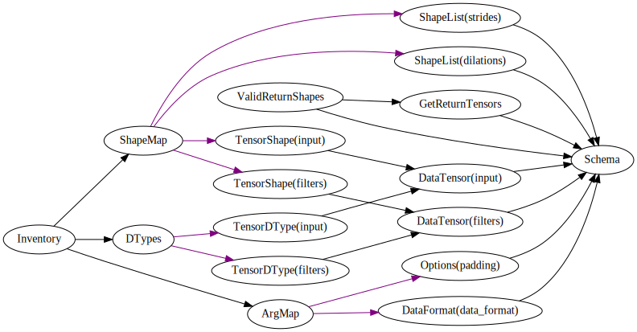

# Towards a robust TensorFlow frontend validation

TensorFlow ops are highly polymorphic, accepting sometimes thousands of combinations
of tensor shapes, dtypes, and other control settings.  In many cases, the variety of
such allowed inputs is not fully documented.  Violating the hidden constraints leads
to often cryptic exception messages often arising very deep into the stack, or even
program abort().  In this note, I present a proposed solution and proof-of-concept
repo.

What would a robust frontend look like?  First, inputs should be checked as early as
possible.  This means, any invalid tensor shape relationships or dtypes will be
caught by the validation logic of the top-level op.  An exception would then be
raised, which would be shallow in the stack.  The exception message would use actual
names of op arguments, and state exactly what constraint is violated, as specifically
as possible.  It could do this if it had knowledge of all of the constraints defining
valid op inputs, as well as all of the inputs provided to the op.

To achieve this, a precise mechanism for defining the set of valid inputs for an op
would be needed, which I propose here.  It turns out that this mechanism produces two
other things almost for free.  First, it provides a way to generate a thorough set of
valid and invalid test cases, useful for unit testing.  Second, a way to generate
human-readable documentation that precisely describes the rules that the valid inputs
must follow.

The mechanism consists of a compact API for building up the set of rules
incrementally.  A typical op requires about 50 lines of code written in this API to
fully define the op's *schema*.


# Possible approach - composable constraints

Since user-facing TensorFlow ops are intricate compositions of lower level ops, it is
reasonable to hope that one can define top-level op constraints in terms of lower
level constraints.  Doing so would be very convenient and maintainable - one could
simply implement lower level checks in internal ops, and they would throw when
violated.  No extra work would be needed besides composing these ops for the
computation itself.

Unfortunately, it seems that it is not possible to achieve informative error messages
this way.  If it were, then the high level code could catch and re-throw exceptions
arising from deeper levels, contextualizing them.  But this seems not to be the case.

I would guess it is unlikely that constraints violated on lower level op inputs could
be meaningfully translated up to the user in terms of the tensor shapes, layout etc
of the called op.  At least, this would be difficult for the developer to reason
backwards and supply the proper message.

Instead, I am advocating defining a *schema* for each top-level op, which has no
knowledge of, or reliance on the implementation of that op.  The main principles
behind a proof-of-concept API for building each op schema is presented below.

The API has evolved quite a bit.  So far, I have only used it to implement schemas
for these ops:

```bash
$ python -m opschema.cl list
tf.gather_nd
tf.nn.atrous_conv2d
tf.nn.atrous_conv2d_transpose
tf.nn.avg_pool
tf.nn.bias_add
tf.nn.conv_transpose
tf.nn.convolution
tf.nn.depth_to_space
tf.nn.separable_conv2d
tf.nn.space_to_batch
tf.nn.space_to_depth
tf.raw_ops.LSTMBlockCell
tf.scatter_nd
```

The schemas are not perfect descriptions of the TensorFlow op behavior.  In some
cases, this is due to a shortcoming of the schema.  In others, they reveal likely
bugs in the TensorFlow ops.

# Comprehensive Unit tests

As will be described below, a schema which logically defines the set of valid inputs
for a given op contains all the information, in theory, needed to generate a full
range of valid inputs, as well as invalid inputs.  This can be extremely large due
to the combinatorics of polymorphism displayed by some of the ops.  For instance,
`tf.nn.convolution` supports at least five (so far tested) batch dimensions in
combination with 1, 2, or 3 spatial dimensions, producing 15 combinations based on
input tensor ranks.  Each of these can be one of two basic layouts: the 'channel
first' variety, with `data_format` NCW, NCHW or NCDHW, or the channel last' variety,
with `data_format` NWC, NHWC, or NDHWC.  padding can be either 'SAME' or 'VALID', so
that the combinations are now 5 * 3 * 2 * 2 = 60.

For each group of logical dimensions, we also want to test ordinary non-zero
dimension size, and the zero-size dimension edge case.  There are 8 different groups
bearing dimension sizes:  *batch*, *input spatial*, *input channel*, *filter
spatial*, *filter input channel*, *output channel*, *stride*, and *dilation*.  

In generating test cases, each of these could or could not contain a zero dimension,
giving 2**8 = 256 different combinations.  In addition, we would like to check edge
cases in which the input channel is or is not divisible by filter input channel.  Yet
another test is to choose input spatial and filter spatial dimensions that lead to
positive or negative output spatial dimensions, to test the behavior of exceptions.

On top of all of these combinations, there are allowed and disallowed dtypes for
'input' and 'filter' tensors.  We would like to test all valid combinations to
confirm proper behavior, as well as some selection of invalid combinations.

Using such comprehensive testing, I have discovered many configurations for
`tf.nn.space_to_batch` and `tf.raw_ops.LSTMBlockCell` which cause an `abort()`.  To
take another example, the convolution related ops `tf.nn.convolution`,
`tf.nn.conv_transpose` and `tf.nn.atrous_conv2d` raise an exception with the message
`No algorithm worked!` in many cases.

Below I outline the main principles of `opschema` and how it can be used to concisely
define schemas for TensorFlow ops.

# Principles of opschema

opschema provides a framework for defining *schemas* for TensorFlow ops which define
the set of all possible valid inputs.  In particular, this framework simultaneously
provides:

* predicate to judge input valid or not, with correct error messages
* generator to produce valid and invalid test inputs
* automated documentation describing the predicate logic

*opschema* internally constructs the generator and predicate functions based on the
*schema* API calls.  

Mathematically, the predicate and generator functions implicitly define the same set.
The predicate tests set membership.  The generator produces set members.  Here, the
*set* corresponds with an op, such as `tf.nn.convolution`.  Each element of the set
represents a valid setting of parameter values,  For example:

    # one set element
    input=[97, 13, 9]:float64
    filters=[3, 13, 20]:float64
    strides=[1]
    padding=SAME
    data_format=NCW
    dilations=5

As mentioned above, the number of valid + invalid edge case settings for an op is
exponential in the number of separate categories to be tested.

In order to achieve this combinatoric behavior in a flexible way, `opschema` builds
up a **predicate computation graph** and a **generator computation graph** to
implement the predicate and generator functions respectively.

As a high level illustration, a predicate computation graph is a computation graph
whose nodes are special predicate functions.  The functions actually return a tuple
of (success, value), where success is the predicate, and value is a value to be input
into child nodes' predicate functions.  The entire graph becomes a predicate whose
value is true if and only if all nodes evaluate to true.  To 'evaluate' the graph,
the nodes are evaluated one by one in topological order, starting with nodes that
have no parents.

The generator computation graph is similar, except that the functions are generator
functions.  The entire graph becomes a generator function whose values reflect all
possible combinations of the individual generator nodes.  However, they aren't
independent - each generator function takes inputs from its parents, and is invoked
once for each possible setting of these inputs.

# `opschema` predicate graphs

The predicate graph actually used by the `tf.nn.convolution` schema is shown here:



It is evaluated in topological order, parents first.  The 'Schema' node takes no
arguments and returns (True, arg_dict).  Each child node extracts a particular value
based on its name.  For instance, 'ShapeList(strides)' takes arg_dict['strides'] as
input.  Its job is to validate that it is either an integer or list of integers.  If
so, it returns (True, arg_dict['strides']).  If not, it returns (False, ErrorReport),
which is a class that produces a human-readable error message.  The node
`DataTensor(input)` extracts `arg_dict['input']` and validates that it is a tensor,
passing it along if so.

Nodes `TensorShape(input)` and `TensorDType(input)` always succeed - they are
guaranteed to receive a tensor, and their only job is to extract and pass on its
shape or dtype respectively.

At the next level, nodes `ShapeMap` and `DTypes` always succeed.  Their job is to
aggregate the outputs of their parents.  `ShapeMap` produces `{ 'input': <shape>,
'filters': <shape> }` (the shapes of the input and filters tensors, respectively).

Similarly, the aggregator node `ArgMap` collects argument values of certain other
types.  All of these aggregators feed into the `Inventory` node, where the main work
is done.

Note now that the input information, after being validated for the correct types, is
divided into shapes, dtypes, and other.  The shapes consist not just of tensor shapes
but in this case other quantities (strides and dilations) which participate in
shape-based calculations.  The 'other' are control parameters that affect the
interpretation of existing shapes (i.e. `data_format`) or the computation of other
shapes (`padding`).

Within the `Inventory` node, the predicate function is actually implemented by an
enclosed predicate computation graph diagrammed below:

</img>


```python
def func(i):
  ...
```

And suppose that it accepts even, non-negative integers.  If given an odd or negative
integer, it raises some exception, but the exception doesn't actually inform the user
what is wrong.  Also, suppose the function doesn't document that it only accepts
even, non-negative integers.  Our goal is to separately define a predicate function
that mimics the set of successful inputs of the op.  

A predicate for `func(i)` would be:

```python
def pred_even_ints(i):
  return i >= 0 and i % 2 == 0
```

Given this predicate, a generic recipe for a generator is:

```python
def gen_from_pred(pred):
  def gen(i):
    i = 0
    while True:
      if pred(i):
        yield i
      i += 1
  return gen
```

Conversely, if we start with a generator:

```python
def gen_even_ints():
  i = 0
  while True:
    yield i
    i += 2
```

a generic recipe for a predicate is:

```python
def pred_from_gen(gen, i):
  def pred(i):
    for j in gen:
      if i == j:
        return True
      if i < j:
        # assumes gen is monotonic
        return False
  return pred
```


# Hierarchy

In the above example, I provided a predicate and generator to define the set of
non-negative even integers.  Such a set symbolized the set of valid inputs to some
hypothetical function to model.


Suppose now we have a function f(x, y) which either succeeds or fails, and we want to
write a schema for it.  


```python
pip install opschema
```

# Unit tests for Tensor Ops

Here I describe an idea and proof of concept PyPI package for generating a
comprenhensive set of unit tests for select Tensor operations.  As with any good unit
test, its goal is to cover all possible code paths leading to success or error, with
at least one representative example for each code path.

The approach will be to use a structure called a *generation graph* to build up the
op inputs one aspect at a time.  A generation graph here is defined as kind of
computation graph, in which each node holds a generator function taking zero or more
arguments.  Each argument is provided in order by the node's parents (if any).  Once
constructed, the graph itself becomes a generator of tuples, with each component of
the tuple coming from one node.


```python
class Node(object):
  def __init__(self, name, gen_func):
    self.name = name
    self.gen_func = gen_func
    self.parents = []
    self.cur_val = None

  def add_parent(self, node):
    self.parents.append(node)

  def __iter__(self):
    # resolve the current values of parent nodes
    pvals = tuple(pa.cur_val for pa in self.parents)

    # instantiate the iterator
    it = self.gen_func(*pvals)
    return it

def iter_graph(*topo_nodes):
  # recursively iterate through all configurations
  names = [n.name for n in topo_nodes]
  vals = [None] * len(topo_nodes)

  def _gen_rec(i):
    if i == len(topo_nodes):
      yield dict(zip(names, vals))
      return
    node = topo_nodes[i]
    for val in iter(node):
      node.cur_val = val
      vals[i] = val
      yield from _gen_rec(i+1)
  
  yield from _gen_rec(0)
```


```python
def gen5():
  yield from range(5)

def gen8(a):
  yield from range(a+1, 8)

n1 = Node('A', gen5)
n2 = Node('B', gen8)
n2.add_parent(n1)

print('\n'.join(str(m) for m in iter_graph(n1, n2)))

```

    {'A': 0, 'B': 1}
    {'A': 0, 'B': 2}
    {'A': 0, 'B': 3}
    {'A': 0, 'B': 4}
    {'A': 0, 'B': 5}
    {'A': 0, 'B': 6}
    {'A': 0, 'B': 7}
    {'A': 1, 'B': 2}
    {'A': 1, 'B': 3}
    {'A': 1, 'B': 4}
    {'A': 1, 'B': 5}
    {'A': 1, 'B': 6}
    {'A': 1, 'B': 7}
    {'A': 2, 'B': 3}
    {'A': 2, 'B': 4}
    {'A': 2, 'B': 5}
    {'A': 2, 'B': 6}
    {'A': 2, 'B': 7}
    {'A': 3, 'B': 4}
    {'A': 3, 'B': 5}
    {'A': 3, 'B': 6}
    {'A': 3, 'B': 7}
    {'A': 4, 'B': 5}
    {'A': 4, 'B': 6}
    {'A': 4, 'B': 7}

